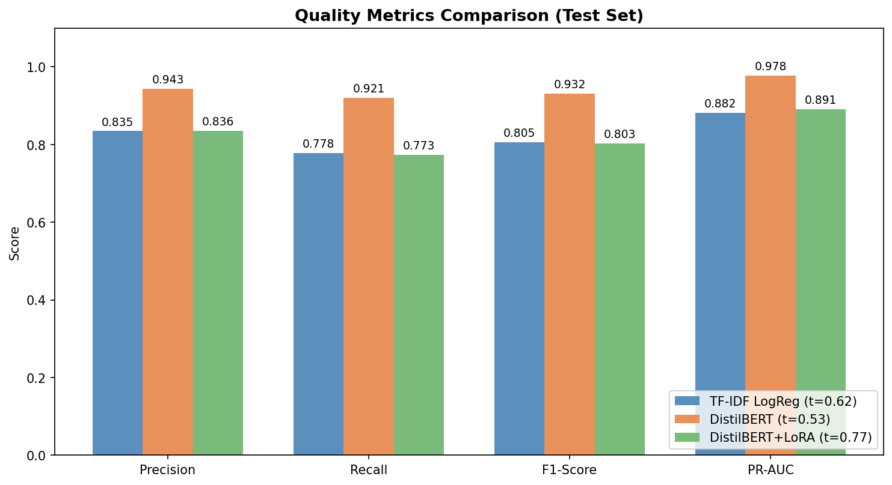
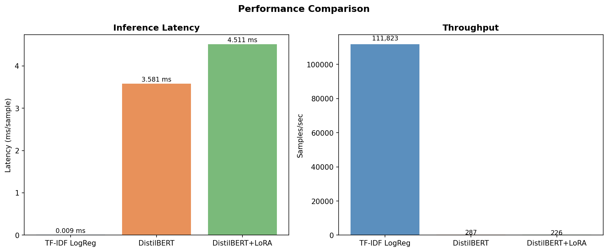
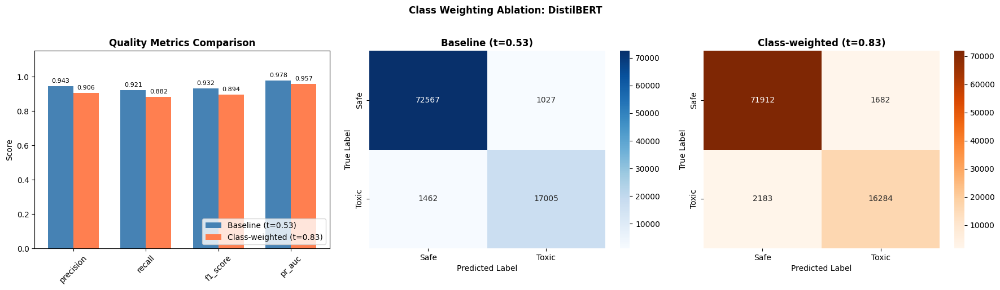
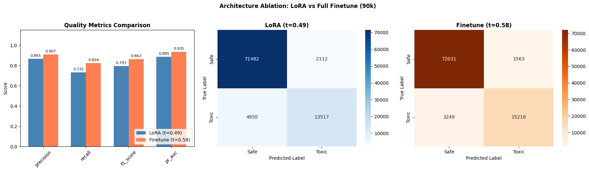
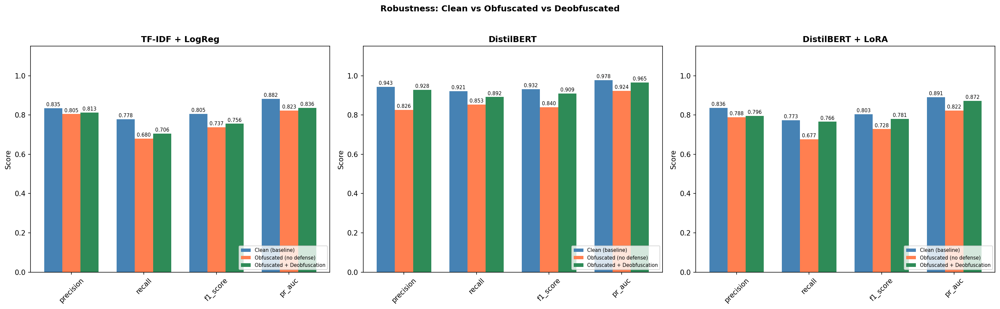
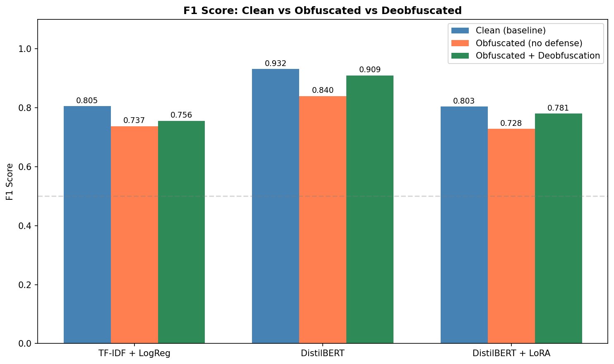

# Final Report: Fast and Resource-Efficient Toxic-Text Classifiers for Bilingual (Russian + English) Corpora

**Authors:** Arthur Babkin, Alexander Malyy | **Course:** Generative AI, Spring 2026
**Repo:** [github.com/ArthurBabkin/GenAI-Safety-Fliter](https://github.com/ArthurBabkin/GenAI-Safety-Fliter)

---

## 1. Problem statement

Toxic-text classifiers are used in many deployment scenarios — social-platform moderation, comment filtering, and, increasingly, as post-generation safety filters for large language models. In any of these settings the classifier sits on a latency-sensitive path, creating a direct tension between detection quality and serving cost.

Lightweight models (e.g., TF-IDF + logistic regression) add negligible latency but miss subtle or context-dependent toxicity. More expressive models (e.g., fine-tuned transformers) catch more, but at 100-400x the serving cost. A third axis matters too: adversarial robustness. Adversaries can obfuscate toxic text with leetspeak, character spacing, or Unicode tricks. A filter that scores well on clean test data may fail in practice if it cannot handle these perturbations.

This project compares three toxic-text classification architectures under a unified evaluation protocol, measuring quality, speed, and robustness on a bilingual (Russian + English) corpus of short user-generated comments. **Scope note:** we evaluate on social-media comment corpora; extension to generated LLM outputs or real user–AI conversation traces is out of scope and is discussed in §7 Limitations.

## 2. Data

### 2.1 Sources

We combine four public datasets into a single binary classification corpus (safe / toxic):

| Source | Samples | Toxic % | License |
|--------|---------|---------|---------|
| Toxic Russian Comments (Blackmoon) | 248,290 | 17.96% | GPL 2 |
| Jigsaw Toxic Comment Challenge | 159,571 | 10.17% | Kaggle Competition Rules |
| Combined Hate Speech (Abusaqer) | 48,049 | 57.78% | CC BY 4.0 |
| Russian Toxic Comments (Semiletov) | 14,412 | 33.49% | CC BY-NC-SA 4.0 |
| **Total (raw)** | **470,322** | **19.86%** | |

Language distribution: 56% Russian, 44% English. The ~80/20 safe/toxic class imbalance is a known challenge addressed in ablation studies (Section 5).

### 2.2 Preprocessing

Text cleaning removed HTML tags/entities (7,998 rows), URLs (9,763), Wikipedia metadata (3,677), IP addresses (9,777), control characters, and short texts (<=2 chars). After cleaning: 470,268 samples (54 dropped, <0.01%).

MinHash-based Locality-Sensitive Hashing (128 permutations, Jaccard threshold t=0.80) removed 9,965 near-duplicate rows (2.1%). The threshold was selected by qualitative inspection: t=0.80 catches template spam (e.g., Wikipedia boilerplate differing only in article name) while preserving all meaningfully distinct examples.

**Final dataset: 460,303 samples.** Two-stage stratified split (seed=42): first 80/20 into train pool (368,242) and test (92,061), then 90/10 within the train pool into train (331,417) and validation (36,825). For LoRA, the train pool is first subsampled to 100K before the 90/10 split, yielding train=90K, val=10K (test remains 92K).

### 2.3 Obfuscation stress set

A separate obfuscated test set was generated by applying deterministic transforms to the canonical test split (92,061 samples). Each word has a 40% probability of being transformed (seeded per-sample for reproducibility). Four transform types are sampled by weighted random selection:

- Leetspeak substitution (a->4, e->3, etc.) at 30% weight
- Character spacing ("hate" -> "h a t e") at 25%
- Character repetition ("hate" -> "haatte") at 25%
- Mixed case ("hate" -> "hAtE") at 20%

For Russian text, Cyrillic-to-Latin homoglyph substitution is also applied (e.g., Cyrillic "a" -> Latin "a").

A deobfuscated version of this stress set was produced by applying a rule-based defense pipeline: Unicode normalization, collapse spaced characters (3+ single chars with spaces), lowercase, reverse leetspeak, and collapse 3+ repeated characters to one. This defense is intentionally imperfect, testing how much quality can be recovered with simple preprocessing.

## 3. Models

### 3.1 TF-IDF + logistic regression

TF-IDF vectorizer (10K features, unigrams + bigrams, min_df=5, max_df=0.8) followed by L2-regularized logistic regression (C=1.0, max_iter=1000, L-BFGS solver). Trained on a balanced 133K subset (safe class undersampled to 50/50), which improved F1 by +4.1pp over the original imbalanced training (see Section 5.1). This is the promoted global checkpoint used for all subsequent experiments.

### 3.2 DistilBERT (full fine-tuning)

`distilbert-base-uncased` (67.6M parameters) with a 2-class classification head. Max sequence length: 128 tokens. AdamW optimizer (lr=2e-5, weight_decay=0.01), linear warmup (10% of steps), gradient clipping (max_norm=1.0). 3 epochs, batch_size=64. Early stopping on validation loss with patience=2. Trained on the full 331K training split (original 80/20 class distribution). No class balancing was applied because ablations showed it hurts this model (Section 5.2).

### 3.3 DistilBERT + LoRA

Same base model with LoRA adapters (rank=8, alpha=16, dropout=0.1) on attention projection layers (`q_lin`, `v_lin`). Only 739K trainable parameters (1.09% of total). AdamW (lr=3e-4), 2 epochs, batch_size=128, early stopping with patience=1. Trained on a balanced 90K subset (drawn from a 50/50 pool of the full dataset), which improved F1 by +1.1pp over imbalanced 90K training (see Section 5.1). This is the promoted global checkpoint.

## 4. Results

All models evaluated on the same 92,061-sample test set (~20% toxic). Decision thresholds tuned on the validation set by sweeping 0.10-0.90 and selecting the threshold that maximizes F1.

| Model | Precision | Recall | F1 | PR-AUC | Threshold | Latency (ms) | Throughput |
|-------|-----------|--------|----|--------|-----------|-------------|------------|
| TF-IDF + LogReg | 0.8346 | 0.7782 | 0.8054 | 0.8820 | 0.62 | 0.009 | 112K/s |
| DistilBERT | **0.9430** | **0.9208** | **0.9318** | **0.9781** | 0.53 | 3.58 | 287/s |
| DistilBERT + LoRA | 0.8360 | 0.7734 | 0.8035 | 0.8911 | 0.77 | 4.51 | 226/s |

DistilBERT dominates on quality: +12.6pp F1 over LogReg, +12.8pp over LoRA. LogReg throughput is ~390x higher than either transformer variant. LoRA's quality is comparable to LogReg but at transformer-level latency, making it a poor trade-off for serving. Its value is in training efficiency: reaching 86% of full fine-tuning quality with 1% of trainable parameters.

### 4.1 Per-language results (Russian vs English)

The corpus is 56% Russian / 44% English, but the transformer backbone (`distilbert-base-uncased`) was pretrained on English only, lowercases input, and strips accents. Cyrillic text is handled via byte-level WordPiece fallback rather than proper subword tokens. To quantify this mismatch we split the test set by language (source-dataset tags + Cyrillic-codepoint heuristic for ambiguous rows) and recomputed all metrics at the same tuned thresholds as §4.

| Model | Lang | n | Precision | Recall | F1 | PR-AUC | EN–RU F1 gap |
|-------|------|---|-----------|--------|----|--------|--------------|
| TF-IDF + LogReg | EN | 39,906 | 0.8387 | 0.8173 | **0.8278** | 0.9068 | — |
| TF-IDF + LogReg | RU | 52,155 | 0.8308 | 0.7441 | **0.7851** | 0.8596 | **+4.3pp** |
| DistilBERT | EN | 39,906 | 0.9515 | 0.9219 | **0.9364** | 0.9829 | — |
| DistilBERT | RU | 52,155 | 0.9358 | 0.9199 | **0.9278** | 0.9742 | **+0.9pp** |
| DistilBERT + LoRA | EN | 39,906 | 0.8503 | 0.8480 | **0.8491** | 0.9349 | — |
| DistilBERT + LoRA | RU | 52,155 | 0.8217 | 0.7084 | **0.7608** | 0.8461 | **+8.8pp** |

The result is more nuanced than the English-only-tokenizer hypothesis predicts. DistilBERT with full fine-tuning shows only a 0.9pp EN/RU gap — byte-level WordPiece fallback combined with 67.6M trainable parameters is evidently enough to realign the pretrained representation for Russian. LoRA, by contrast, shows the largest gap (8.8pp): with only ~1% of parameters trainable, LoRA cannot compensate for the English-biased pretrained weights when inputs are Cyrillic. TF-IDF + LogReg lies in between (4.3pp) because character-level features survive script differences but inherit the vocabulary imbalance between the Russian and English training corpora.

**Practical implication.** Full fine-tuning of an English backbone on a bilingual corpus is viable when compute allows; LoRA on the same backbone is not a drop-in substitute for multilingual deployments. A truly multilingual backbone (XLM-RoBERTa, mDeBERTa) remains the principled choice; see §7 Limitations.


*Figure 1. Quality metrics across three models at tuned thresholds.*


*Figure 2. Inference latency and throughput comparison.*

## 5. Ablation studies

### 5.1 Class imbalance (undersampling)

The dataset is ~80/20 safe/toxic. We tested whether balancing the training set (undersampling the safe class to 50/50) improves detection quality.

| Model | Baseline F1 | Balanced F1 | Delta | Effect |
|-------|------------|-------------|-------|--------|
| LogReg (331K -> 133K) | 0.7647 | 0.8054 | **+4.1pp** | Helps |
| DistilBERT (331K -> 133K) | 0.9318 | 0.8844 | -4.7pp | Hurts (data loss) |
| LoRA (90K -> 36K) | 0.7929 | 0.7300 | -6.3pp | Hurts (data loss) |
| LoRA (90K -> 90K balanced) | 0.7929 | 0.8035 | **+1.1pp** | Helps (size held) |

The pattern is model-dependent. Linear models benefit from balanced priors because their decision boundary is directly influenced by class frequency. The full transformer already achieves 92% recall on imbalanced data, so undersampling only removes useful training examples. For LoRA, we ran a controlled experiment holding training size constant at 90K while balancing the distribution. This isolated the distribution effect from data loss and confirmed that balanced distribution helps LoRA modestly (+1.1pp).

Both LogReg (balanced 133K) and LoRA (balanced same-size 90K) improvements were promoted to their respective global checkpoints and used for all subsequent experiments.

### 5.2 Class weighting (DistilBERT)

Can class-weighted loss (~4x weight on toxic examples) recover the benefit of balanced training without discarding data? Same 331K splits, same architecture, only the loss function changes.

| Model | Precision | Recall | F1 | PR-AUC | Threshold |
|-------|-----------|--------|----|--------|-----------|
| Baseline (331k) | **0.9430** | **0.9208** | **0.9318** | **0.9781** | 0.53 |
| Class-weighted (331k) | 0.9064 | 0.8818 | 0.8939 | 0.9567 | 0.83 |
| Delta | -0.0367 | -0.0390 | **-3.8pp** | -0.0214 | |

Class weighting hurt by -3.8pp F1. The threshold shifted from 0.53 to 0.83: the 4x loss weight on toxic examples inflated toxic-class probabilities, breaking calibration. PR-AUC also dropped -2.1pp, confirming that ranking quality degraded independently of threshold choice. The root cause: the full fine-tuned model has no majority-class bias to correct. Both undersampling (-4.7pp) and class weighting (-3.8pp) assume imbalance hurts the model, but for a pretrained transformer on 331K samples that assumption is wrong.


*Figure 3. Full fine-tune baseline vs class-weighted loss on 331k.*

### 5.3 Architecture: LoRA vs full fine-tune on same data

Is the quality gap between LoRA and full fine-tune caused by less training data (90K vs 331K) or by the adapter approach itself? We trained both architectures on the same 90K split.

| Model | Precision | Recall | F1 | PR-AUC |
|-------|-----------|--------|----|--------|
| LoRA (90k) | 0.8649 | 0.7320 | 0.7929 | 0.8853 |
| Full fine-tune (90k) | **0.9069** | **0.8241** | **0.8635** | **0.9354** |
| Delta | +0.0420 | +0.0921 | **+7.1pp** | +0.0501 |

Full fine-tune wins by +7.1pp F1 on identical data. The recall gap is especially large (+9.2pp). LoRA's 1% parameter budget limits its ability to learn discriminative features for the toxic class. The total gap from the main comparison (13.9pp) breaks down roughly in half: ~7pp from architecture, ~7pp from data size.


*Figure 4. LoRA vs full fine-tune trained on the same 90k samples.*

### 5.4 Robustness: obfuscation stress test

All three models evaluated on the obfuscated test set (Section 2.3) using their tuned thresholds from clean validation data. No retraining.

| Model | Clean F1 | Obfuscated F1 | Delta | Deobfuscated F1 | Recovery |
|-------|----------|--------------|-------|----------------|----------|
| TF-IDF + LogReg | 0.8054 | 0.7373 | -6.8pp | 0.7555 | 26.8% |
| DistilBERT | 0.9318 | 0.8395 | -9.2pp | 0.9095 | 75.8% |
| DistilBERT + LoRA | 0.8035 | 0.7283 | -7.5pp | 0.7806 | 69.5% |

All models degrade under obfuscation, with similar relative drops (~8-10%). DistilBERT has the largest absolute drop (-9.2pp) because it starts from the highest baseline.

The deobfuscation defense is far more effective for transformers than for TF-IDF. DistilBERT recovers 75.8% of lost performance (F1 0.84 -> 0.91), nearly matching its clean baseline. TF-IDF recovers only 26.8% (F1 0.74 -> 0.76). The reason: deobfuscation is imperfect text normalization. Transformers tolerate minor text variations because they were pre-trained on diverse text, so approximate normalization still lands in a familiar region of the model's input space. TF-IDF requires exact surface-form matches; imperfect normalization introduces new mismatches even as it fixes old ones.


*Figure 5. Quality metrics under clean, obfuscated, and deobfuscated conditions.*


*Figure 6. F1 degradation across models and conditions.*

### 5.5 Summary: all ablations

| Ablation | Model | Baseline F1 | Ablation F1 | Delta | Finding |
|----------|-------|------------|-------------|-------|---------|
| Balanced training (133K) | LogReg | 0.7647 | **0.8054** | +4.1pp | Balanced priors help linear models. Promoted. |
| Balanced training (133K) | DistilBERT | 0.9318 | 0.8844 | -4.7pp | Data loss outweighs balance benefit for transformers. |
| Balanced same-size (90K) | LoRA | 0.7929 | **0.8035** | +1.1pp | Balance helps when size is held constant. Promoted. |
| Class weighting (331K) | DistilBERT | 0.9318 | 0.8939 | -3.8pp | No imbalance bias to correct; gradient distortion hurts. |
| Architecture (90K) | LoRA vs Finetune | 0.7929 | 0.8635 | +7.1pp | Architecture explains half the LoRA-finetune gap. |
| Obfuscation (no defense) | LogReg | 0.8054 | 0.7373 | -6.8pp | Surface-level features are brittle to perturbation. |
| Obfuscation (no defense) | DistilBERT | 0.9318 | 0.8395 | -9.2pp | Subword tokenization provides partial but not full robustness. |
| Deobfuscation defense | LogReg | 0.7373 | 0.7555 | +1.8pp | 26.8% recovery. Imperfect normalization still hurts TF-IDF. |
| Obfuscation (no defense) | LoRA | 0.8035 | 0.7283 | -7.5pp | Similar brittleness pattern to LogReg. |
| Deobfuscation defense | DistilBERT | 0.8395 | 0.9095 | +7.0pp | 75.8% recovery. High-value, zero-cost defense for transformers. |
| Deobfuscation defense | LoRA | 0.7283 | 0.7806 | +5.2pp | 69.5% recovery. Transformers benefit regardless of adapter approach. |

**Final best configurations (promoted checkpoints):**

| Model | Config | F1 (clean) | F1 (obfuscated) | F1 (deobfuscated) | Latency | Throughput |
|-------|--------|-----------|----------------|-------------------|---------|------------|
| TF-IDF + LogReg | Balanced 133K | 0.8054 | 0.7373 | 0.7555 | 0.009 ms | 112K/s |
| DistilBERT | Original 331K | **0.9318** | **0.8395** | **0.9095** | 3.58 ms | 287/s |
| DistilBERT + LoRA | Balanced 90K | 0.8035 | 0.7283 | 0.7806 | 4.51 ms | 226/s |

## 6. Deployment recommendations

Recommendations below assume a deployment scenario analogous to our evaluation corpus (short user-generated comments in Russian or English). Generalization to LLM-output moderation or other domains is unverified (§7).

| Use case | Model | Rationale |
|----------|-------|-----------|
| Real-time filtering (CPU) | TF-IDF + LogReg | 0.009ms latency, CPU-only, 0.5 MB. Acceptable quality (F1=0.81) when latency budget is <1ms. |
| Batch safety review | DistilBERT + deobfuscation | Best quality (F1=0.93 clean, 0.91 with defense), 287 samples/sec. Add deobfuscation preprocessor for adversarial robustness at no retraining cost. Full fine-tuning also largely closes the English/Russian gap (§4.1). |
| Rapid prototyping | LoRA | 6x faster training than full fine-tune, ~1% trainable parameters. Not recommended for production serving: transformer-level latency with LogReg-level quality, and the largest EN/RU gap (§4.1). |

The robustness results add a clear recommendation: any transformer-based deployment should include a deobfuscation preprocessor. It recovers 76% of obfuscation-induced quality loss with zero retraining and negligible additional latency (string operations on CPU). For TF-IDF deployments, the same preprocessor helps less (27% recovery), and the fundamental brittleness of surface-level features remains.

## 7. Ethics and safety considerations

Safety filters can be misused for excessive censorship or used to suppress legitimate speech. This project focuses on the performance characteristics of different filter architectures, not on policy decisions about what content should be filtered. The choice of filtering threshold and the definition of "toxic" are deployment decisions that depend on context.

The training datasets contain offensive and harmful language by design. No private or personally identifiable information was collected or generated. All datasets are publicly available under research-compatible licenses (Section 2.1).

The obfuscation experiments demonstrate that determined adversaries can degrade filter quality by 7-9pp F1 with simple text transforms. This is a known limitation of text classifiers. The deobfuscation defense recovers most of the lost quality for transformer models but is not a complete solution: more sophisticated evasion techniques (semantic paraphrasing, adversarial perturbations) are outside the scope of this work.

## 8. Reproducibility

All random seeds are fixed at 42. All reported metrics are single-run results; variance across seeds is not reported due to compute constraints (transformer training takes 2-3 hours per run). Pre-trained model checkpoints and data splits are committed to the repository (model weights via git-lfs).

### 8.1 Compute environment

| Hardware | Used for |
|----------|----------|
| Apple M4 Pro (24 GB) | Main model training, LogReg ablation, DistilBERT class-imbalance ablation, LoRA class-imbalance ablation, robustness evaluation |
| Apple M1 Max (32 GB) | DistilBERT class-weighting ablation, LoRA vs full fine-tune ablation |

All training runs on CPU/MPS (Apple Silicon). No cloud GPUs were used.

| Experiment | Dataset | Epochs | Wall time | Hardware | Source |
|------------|---------|--------|-----------|----------|--------|
| LogReg (balanced) | 133K | — | <1 min | M4 Pro | `logreg/class_imbalance` |
| DistilBERT class-weighting | 331K | 3 | ~3h 23min | M1 Max | `transformer/class_weighting` |
| DistilBERT class-imbalance | 133K | 3 | ~1h 53min | M4 Pro | `transformer/class_imbalance` |
| LoRA class-imbalance (balanced) | 90K | 2 | ~37 min | M4 Pro | `transformer_lora/class_imbalance` |
| Full fine-tune vs LoRA | 90K | 3 | ~56 min | M1 Max | `transformer_lora/finetune_vs_lora` |

Global model training (via CLI) was not separately timed, but the time derived from the ablations is sufficient to approximate the training time.

### 8.2 Commands

**Training:**
```bash
python -m model.train --model logreg --data data/train_dataset_clean.csv --output data/models/logreg
python -m model.train --model transformer --data data/train_dataset_clean.csv --output data/models/transformer
python -m model.train --model transformer_lora --data data/train_dataset_clean.csv --output data/models/transformer_lora --train-subset 100000
```

**Evaluation:**
```bash
python -m model.evaluate --model logreg --model-dir data/models/logreg
```

**Sampling (inference on arbitrary text):**
```bash
python -m model.sample --model transformer --model-dir data/models/transformer "You are stupid" "Have a nice day"
```

**Robustness evaluation:**
```bash
python -m model.experiments.robustness.run_evaluation
```

**Ablation notebooks:** `model/experiments/{logreg,transformer,transformer_lora}/class_imbalance/`, `model/experiments/transformer/class_weighting/`, `model/experiments/transformer_lora/finetune_vs_lora/`, `model/experiments/robustness/`.

## References

1. Jigsaw Toxic Comment Classification Challenge. *Kaggle.* `https://www.kaggle.com/competitions/jigsaw-toxic-comment-classification-challenge`
2. Blackmoon. *Russian Language Toxic Comments Dataset.* Kaggle. `https://www.kaggle.com/datasets/blackmoon/russian-language-toxic-comments`
3. Semiletov, A. *Toxic Russian Comments Dataset.* Kaggle. `https://www.kaggle.com/datasets/alexandersemiletov/toxic-russian-comments`
4. Abusaqer, M. *Combined Hate Speech Dataset.* Kaggle. `https://www.kaggle.com/datasets/mahmoudabusaqer/combined-hate-speech-dataset`
5. Devlin, J., Chang, M.-W., Lee, K., & Toutanova, K. *BERT: Pre-training of Deep Bidirectional Transformers for Language Understanding.* NAACL-HLT, 2019.
6. Sanh, V., Debut, L., Chaumond, J., & Wolf, T. *DistilBERT, a distilled version of BERT: smaller, faster, cheaper and lighter.* NeurIPS Workshop, 2019.
7. Hu, E. J., Shen, Y., Wallis, P., Allen-Zhu, Z., Li, Y., Wang, S., Wang, L., & Chen, W. *LoRA: Low-Rank Adaptation of Large Language Models.* ICLR, 2022.
8. Schmidt, A., & Wiegand, M. *A Survey on Hate Speech Detection using Natural Language Processing.* Proceedings of the 5th International Workshop on Natural Language Processing for Social Media, 2017.
9. Fortuna, P., & Nunes, S. *A Survey on Automatic Detection of Hate Speech in Text.* ACM Computing Surveys, 2018.
