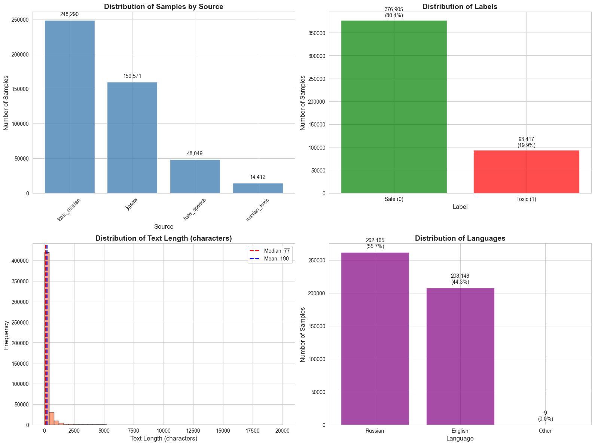
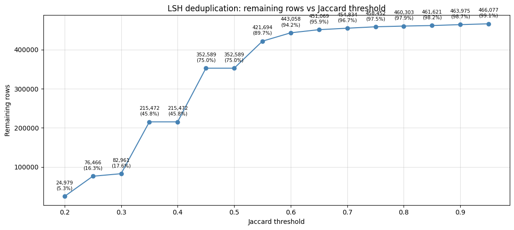
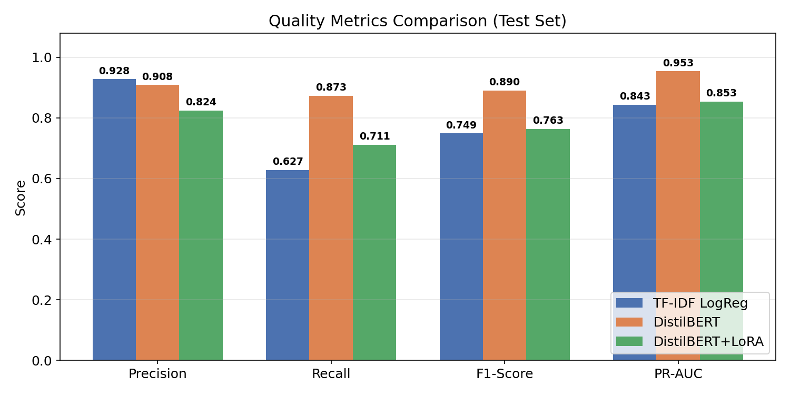
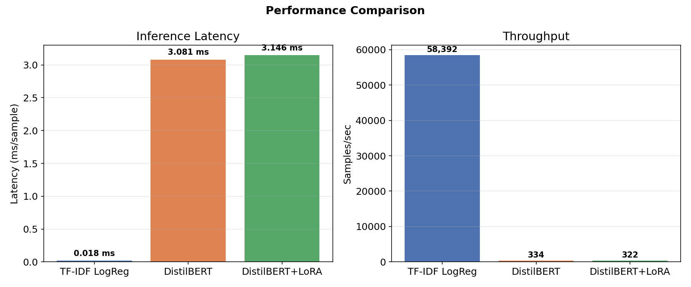
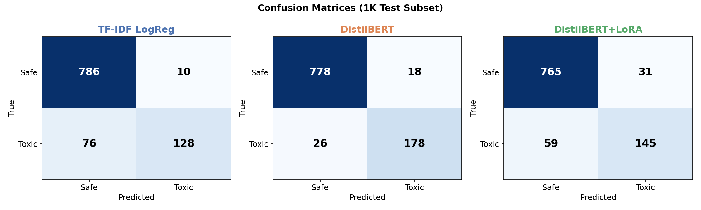
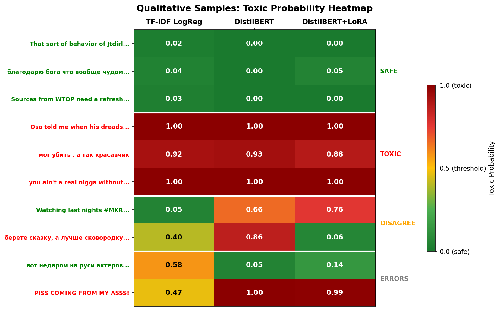
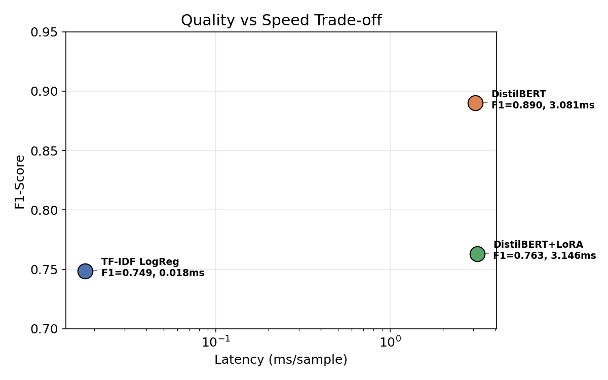

# Midterm Report: Fast and Resource-Efficient Safety Filters for LLM Outputs

**Authors:** Arthur Babkin, Alexander Malyy | **Course:** Generative AI, Spring 2026
**Repo:** [github.com/ArthurBabkin/GenAI-Safety-Fliter](https://github.com/ArthurBabkin/GenAI-Safety-Fliter)

---

## 1. Problem Statement

Post-generation safety filters for LLMs must balance detection quality against inference speed. Lightweight models are fast but miss subtle toxicity; expressive models catch more but cost orders of magnitude more in latency. We systematically compare classical and neural safety filters under a unified evaluation protocol, with specific focus on multilingual (Russian + English) content.

## 2. Data

### 2.1 Sources and composition

We combine four public datasets into a single binary classification corpus (safe/toxic):

| Source | Samples | Toxicity Rate |
|--------|---------|---------------|
| Toxic Russian Comments | 248,290 | 17.96% |
| Jigsaw Toxic Comment Challenge | 159,571 | 10.17% |
| Combined Hate Speech | 48,049 | 57.78% |
| Russian Toxic Comments | 14,412 | 33.49% |
| **Total (raw)** | **470,322** | **19.86%** |

Language distribution: 56% Russian, 44% English. The class imbalance (~80/20 safe/toxic) is a known challenge addressed in our ablation study (Section 5).


*Figure 1. Dataset composition: samples by source, label distribution, text length distribution, and language breakdown.*

### 2.2 Preprocessing

Text cleaning addressed noise from source datasets: HTML tags/entities (7,998 rows), URLs (9,763), Wikipedia metadata/timestamps (3,677), IP addresses (9,777), control characters, CSV quoting artifacts, and short texts (<=2 chars). After cleaning: 470,268 samples (54 dropped, <0.01%).

### 2.3 LSH deduplication

MinHash-based Locality-Sensitive Hashing (128 permutations) was applied across Jaccard thresholds 0.20--0.95 to identify and remove near-duplicate texts.


*Figure 2. Remaining rows vs. Jaccard similarity threshold. Threshold t=0.80 selected.*

**Threshold selection (t=0.80):** Qualitative inspection of near-duplicate pairs at each threshold guided the choice:
- t<=0.65: too aggressive --- removes genuinely different texts sharing common phrases.
- t=0.70--0.75: removes Wikipedia boilerplate where only the article name differs (true redundancy).
- **t=0.80:** removes the same boilerplate class (e.g., *"Your test worked on Andy Griffith"* vs *"Your test worked on T-Bone Walker"*, Jaccard=0.797) while preserving all meaningfully distinct examples. Drops **9,965 rows (2.1%)**.
- t>=0.85: too conservative --- misses large clusters of template spam.

**Final dataset: 460,303 samples** (97.9% of cleaned data), used for all subsequent experiments.

### 2.4 Splitting protocol

All models share the same stratified split (seed=42): 80% train / 10% val / 10% test (331,417 / 36,825 / 92,061 samples). The LoRA model additionally subsamples training data to 100K before splitting (90K train / 10K val), keeping the same test set.

## 3. Models

### 3.1 TF-IDF + Logistic Regression

**Model definition.** TF-IDF vectorizer (10K features, unigrams + bigrams, min_df=5, max_df=0.8) followed by L2-regularized logistic regression (C=1.0, max_iter=1000).

**Training objective.** Standard binary cross-entropy (logistic loss) with L2 penalty. No class weighting.

**Optimization.** L-BFGS solver (scikit-learn default for L2). Converges in a single pass over the data.

**Key design choice.** We use 10K features with bigrams as a compromise between vocabulary coverage and sparsity. Unigrams alone miss multi-word toxic phrases ("go die"), while trigrams add noise without improving F1.

### 3.2 DistilBERT (full fine-tuning)

**Model definition.** `distilbert-base-uncased` (67.6M parameters) with a 2-class sequence classification head. Max sequence length: 128 tokens.

**Training objective.** Cross-entropy loss over 2 classes (safe/toxic), computed by HuggingFace's `AutoModelForSequenceClassification`.

**Optimization.** AdamW (lr=2e-5, weight_decay=0.01), linear warmup (10% of steps), gradient clipping (max_norm=1.0). 3 epochs, batch_size=64. Early stopping on validation loss with patience=2, restoring best checkpoint.

**Key design choice.** DistilBERT over BERT-base: 40% fewer parameters, 60% faster inference, with < 3% quality loss on GLUE benchmarks. The 128-token max length truncates <5% of samples (verified via token length analysis), with no significant class-differential truncation.

### 3.3 DistilBERT + LoRA

**Model definition.** Same base model, with LoRA adapters (rank=8, alpha=16, dropout=0.1) injected into attention projection layers (`q_lin`, `v_lin`). Only 739K trainable parameters (1.09% of total).

**Training objective.** Same cross-entropy loss. Only LoRA parameters are updated; base model weights are frozen.

**Optimization.** AdamW (lr=3e-4, weight_decay=0.01), same warmup/clipping. 2 epochs, batch_size=128. Early stopping with patience=1. Higher learning rate (3e-4 vs 2e-5) is standard for LoRA since the adapter matrices are randomly initialized and need faster convergence.

**Key design choice.** Trained on 90K subset (from 100K with 90/10 train/val split). LoRA converges well on less data due to the strong pretrained representations; the subset reduces training time ~3.5x with minimal quality loss. Rank=8 balances expressiveness vs parameter count.

## 4. Results

### 4.1 Baseline comparison (default threshold = 0.50)

All models evaluated on the same 92,061-sample test set (~20% toxic).

| Model | Precision | Recall | F1 | PR-AUC | Latency (ms) | Throughput |
|-------|-----------|--------|----|--------|-------------|------------|
| TF-IDF + LogReg | 0.9102 | 0.6399 | 0.7515 | 0.8560 | 0.009 | 109K/s |
| DistilBERT | **0.9394** | **0.9234** | **0.9313** | **0.9781** | 3.58 | 287/s |
| DistilBERT + LoRA | 0.8693 | 0.7281 | 0.7925 | 0.8853 | 3.27 | 316/s |


*Figure 3. Quality metrics across three models at default threshold (0.50).*

**Key observations:**
- DistilBERT dominates on quality: +18pp F1 over LogReg, +14pp over LoRA.
- LogReg has extreme precision (0.91) but misses 36% of toxic content.
- LoRA sits between the two on quality but has transformer-level latency (~380x slower than LogReg).
- LogReg throughput is ~380x higher than either transformer variant.


*Figure 4. Inference latency and throughput comparison.*

### 4.2 Threshold tuning

Decision thresholds tuned on the validation set by sweeping 0.10--0.90 and selecting the threshold that maximizes F1.

| Model | Default F1 (t=0.50) | Tuned F1 | Best threshold | Delta |
|-------|---------------------|----------|---------------|-------|
| TF-IDF + LogReg | 0.7515 | 0.7647 | 0.32 | +0.0132 |
| DistilBERT | 0.9313 | 0.9318 | 0.53 | +0.0005 |
| DistilBERT + LoRA | 0.7925 | 0.7929 | 0.49 | +0.0004 |

**Analysis.** Threshold tuning provides a meaningful gain only for LogReg (+1.3pp F1), where the default 0.50 is too conservative --- lowering to 0.32 catches 1,558 more toxic samples at the cost of 1,975 additional false positives. Both transformer models are already well-calibrated at 0.50, with tuned thresholds landing at 0.53 and 0.49 respectively. This reflects the superior probability calibration of cross-entropy-trained neural models vs. logistic regression on sparse TF-IDF features.

### 4.3 Cross-model comparison (tuned thresholds)

| Metric | LogReg (t=0.32) | LoRA (t=0.49) | DistilBERT (t=0.53) |
|--------|-----------------|---------------|---------------------|
| Precision | 0.8098 | 0.8649 | **0.9430** |
| Recall | 0.7243 | 0.7320 | **0.9208** |
| F1 | 0.7647 | 0.7929 | **0.9318** |
| PR-AUC | 0.8560 | 0.8853 | **0.9781** |


*Figure 5. Confusion matrices (1K test subset, baseline report). Full test set (92K) confirms the same patterns at scale.*

### 4.4 Qualitative error analysis

Predictions on 500 random test samples reveal systematic failure modes:


*Figure 6. Toxic probability heatmap across models for selected samples.*

- **TF-IDF misses context-dependent toxicity:** *"PISS COMING FROM MY ASSS!"* scores 0.47 (safe). Bag-of-words features cannot detect vulgarity from word combinations alone.
- **Transformers over-trigger on informal language:** *"Watching last nights #MKR... Celine would be an absolute hoot"* is safe, but DistilBERT (0.66) and LoRA (0.76) flag it. Informal slang patterns overlap with toxic text distributions.
- **Only full DistilBERT catches implicit multilingual toxicity:** *"берете сказку, а лучше сковородку потяжелее..."* (implicit violence in Russian) --- DistilBERT: 0.86, TF-IDF: 0.40, LoRA: 0.06. The full fine-tuning on 331K samples (vs 90K for LoRA) provides better cross-lingual transfer.

## 5. Ablation: Class Imbalance

The dataset is ~80/20 safe/toxic. We test whether balancing the training set (undersampling safe class to 50/50) improves detection quality. All ablation models share the same val/test sets as their baseline for fair comparison. Crucially, the test set retains the original 80/20 distribution --- this reflects the real-world class ratio a deployed safety filter would encounter, so metrics are representative of production performance. Metrics reported at tuned thresholds.

### 5.1 TF-IDF + LogReg

| Metric | Baseline (331K, 20%) | Balanced (133K, 50%) | Delta |
|--------|---------------------|---------------------|-------|
| Precision | 0.8098 | 0.8346 | +0.0248 |
| Recall | 0.7243 | 0.7782 | +0.0539 |
| F1 | 0.7647 | **0.8054** | **+0.0407** |
| PR-AUC | 0.8560 | 0.8820 | +0.0260 |

Balanced training improves F1 by **+4.1pp**, with gains on both precision and recall. The linear model's decision boundary is directly shifted by class priors --- seeing equal toxic/safe examples corrects the bias toward the majority class. PR-AUC also improves (+2.6pp), indicating better ranking quality, not just a threshold effect.

**Confound:** the balanced model trains on 133K samples (vs 331K). The improvement may partly reflect the removal of redundant safe examples rather than pure class balance.

### 5.2 DistilBERT (full fine-tuning)

| Metric | Baseline (331K, 20%) | Balanced (133K, 50%) | Delta |
|--------|---------------------|---------------------|-------|
| Precision | 0.9430 | 0.8860 | -0.0570 |
| Recall | 0.9208 | 0.8828 | -0.0380 |
| F1 | 0.9318 | 0.8844 | **-0.0474** |
| PR-AUC | 0.9781 | 0.9519 | -0.0262 |

Balanced training degrades F1 by **-4.7pp**. Unlike LogReg, the full transformer already achieves 92% recall on imbalanced data --- there is no majority-class bias to correct. Undersampling discards 60% of training data, and the model's quality drops uniformly across all metrics including PR-AUC (-2.6pp), confirming this is a generalization loss, not a threshold artifact.

### 5.3 DistilBERT + LoRA

LoRA trains on a 90K subset (from 100K, 90/10 split), making it more sensitive to data reduction. We run two ablation variants to disentangle the effect of class distribution from data loss:

| Metric | Baseline (90K, 20%) | Balanced (36K, 50%) | Balanced same-size (90K, 50%) |
|--------|---------------------|---------------------|-------------------------------|
| Precision | 0.8649 | 0.7296 | 0.8360 |
| Recall | 0.7320 | 0.7303 | 0.7734 |
| F1 | 0.7929 | 0.7300 | **0.8035** |
| PR-AUC | 0.8853 | 0.8186 | 0.8911 |
| Train size | 90K | 36K | 90K |
| Toxic ratio | 20% | 50% | 50% |

**Balanced undersample (36K):** F1 drops **-6.3pp**. The 60% data reduction devastates precision (-13.5pp) while recall barely changes. The model has too few examples to learn discriminative features.

**Balanced same-size (90K):** F1 improves **+1.1pp** over baseline. By drawing 90K samples from a balanced pool (full dataset, safe undersampled to 50/50), we hold training size constant and isolate the distribution effect. Recall improves +4.1pp with a modest precision trade-off (-2.9pp). PR-AUC also improves slightly (+0.6pp).

**Interpretation.** The two LoRA ablations together reveal that:
1. The degradation in the 36K experiment was caused by **data loss, not balanced distribution**.
2. When training size is held constant, balanced distribution **does help** LoRA --- the same pattern as LogReg, just smaller in magnitude (+1.1pp vs +4.1pp F1).
3. Transformers are less sensitive to class priors than linear models, but not immune. The benefit scales inversely with model capacity: LogReg gains the most, LoRA gains modestly, and full fine-tuning (which already has 92% recall) is hurt by the data loss without needing the balance correction.

### 5.4 Summary

| Model | Baseline F1 | Balanced F1 | Delta | Effect |
|-------|------------|-------------|-------|--------|
| LogReg (331K→133K) | 0.7647 | 0.8054 | **+0.0407** | Helps |
| DistilBERT (331K→133K) | 0.9318 | 0.8844 | -0.0474 | Hurts (data loss) |
| LoRA (90K→36K) | 0.7929 | 0.7300 | -0.0629 | Hurts (data loss) |
| LoRA (90K→90K balanced) | 0.7929 | 0.8035 | **+0.0106** | Helps (size held) |

Class imbalance handling is **model-dependent**: linear models benefit from balanced priors; transformers benefit only when training size is preserved. Naive undersampling hurts transformers because data quantity matters more than class distribution for pretrained representations.

## 6. Deployment Trade-offs


*Figure 7. Quality-speed Pareto frontier. DistilBERT and LogReg define the frontier; LoRA is dominated.*

| Use case | Recommended model | Rationale |
|----------|------------------|-----------|
| Real-time moderation (CPU) | TF-IDF + LogReg | 0.009ms latency, CPU-only, 0.5 MB |
| Batch safety review | DistilBERT | Best quality (F1=0.93), 287 samples/sec |
| Rapid prototyping / training | LoRA | 6x faster training, ~1% trainable params |

LoRA's quality (F1=0.79) does not justify its transformer-level latency for inference. Its value is in **training efficiency**: reaching 85% of full fine-tuning quality with 1% of trainable parameters and 3.5x less training data.

## 7. Repository Restructuring

Since the baseline report, the codebase was refactored to separate model training from experiment analysis. Previously, each model had a monolith notebook (~30 cells) that mixed data loading, training, evaluation, and ablation analysis. This made iteration slow and prevented running training from the command line.

**Changes made:**
- **CLI scripts** (`model/train.py`, `model/evaluate.py`) now handle training and evaluation. Models can be trained and evaluated without Jupyter.
- **Global checkpoints** (`data/models/`) are trained once via CLI and committed to git. They store model weights, data splits (`data_splits.pkl`), and evaluation results.
- **Thin ablation notebooks** (`model/experiments/<model>/<ablation>/`) only handle experiment-specific data preparation and comparison plots. They load the global checkpoint as baseline, derive modified training data (e.g., balanced splits), call the CLI scripts, and visualize results.
- **Promote script** (`model/promote.py`) copies an ablation's weights + splits to the global checkpoint when the user decides to adopt it as the new baseline. This enables stacking ablations on top of each other.
- Ablation outputs are saved locally in each notebook's `data/` directory (gitignored), with caching to skip re-training on subsequent runs.

This separation means adding a new ablation requires only a new notebook that prepares data and calls existing CLI tools --- no changes to model code.

**Training via CLI:**
```bash
python -m model.train --model logreg --data data/train_dataset_clean.csv --output data/models/logreg

python -m model.train --model transformer --data data/train_dataset_clean.csv --output data/models/transformer

python -m model.train --model transformer_lora --data data/train_dataset_clean.csv --output data/models/transformer_lora --train-subset 100000
```

**Evaluation via CLI:**
```bash
python -m model.evaluate --model logreg --model-dir data/models/logreg
```

**Ablation notebooks:** `model/experiments/{logreg,transformer,transformer_lora}/class_imbalance/class_imbalance.ipynb`. Each notebook loads the global model checkpoint, derives modified training data, trains the ablation variant, and produces comparison plots.

All seeds fixed at 42. Pre-trained checkpoints and data splits committed to the repository (model weights via git-lfs) (only best models).

## 8. Planned Improvements

- **Class-weighted loss** --- alternative to undersampling: train on full dataset with loss weighted inversely to class frequency
- **Full finetune vs LoRA on same data** --- make an ablation to fairly analyze lora quality with respect to full finetune
- **Robustness stress testing** --- evaluate on obfuscated test set
- **Deobfuscation preprocessing** --- handle adversarial evasion (spacing, leetspeak, Unicode substitution)

## References

1. Jigsaw Toxic Comment Classification Challenge. *Kaggle.* `kaggle.com/competitions/jigsaw-toxic-comment-classification-challenge`
2. Blackmoon. *Russian Language Toxic Comments Dataset.* `kaggle.com/datasets/blackmoon/russian-language-toxic-comments`
3. Semiletov, A. *Toxic Russian Comments Dataset.* `kaggle.com/datasets/alexandersemiletov/toxic-russian-comments`
4. Abusaqer, M. *Combined Hate Speech Dataset.* `kaggle.com/datasets/mahmoudabusaqer/combined-hate-speech-dataset`
5. Devlin, J., et al. *BERT: Pre-training of Deep Bidirectional Transformers for Language Understanding.* NAACL-HLT, 2019.
6. Sanh, V., et al. *DistilBERT, a distilled version of BERT: smaller, faster, cheaper and lighter.* NeurIPS Workshop, 2019.
7. Hu, E. J., et al. *LoRA: Low-Rank Adaptation of Large Language Models.* ICLR, 2022.
8. Schmidt, A., & Wiegand, M. *A Survey on Hate Speech Detection using NLP.* SocialNLP Workshop, 2017.
